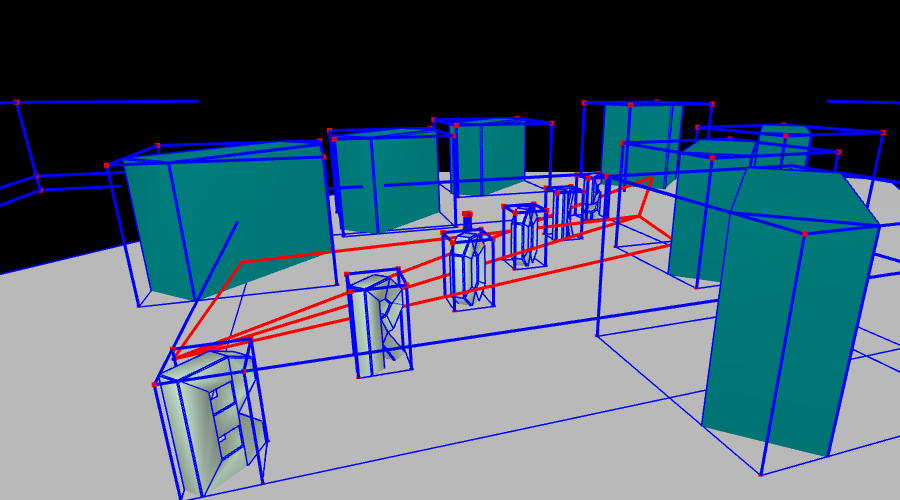
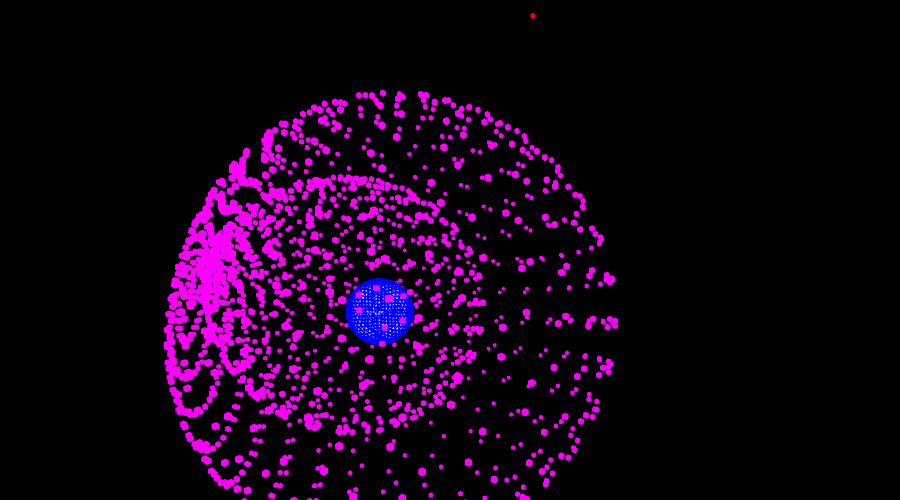
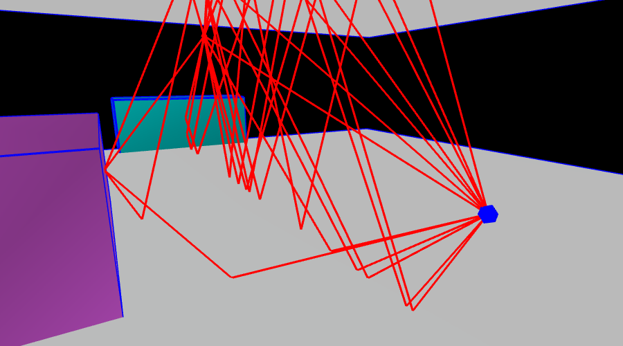
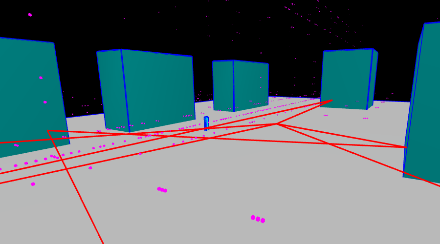
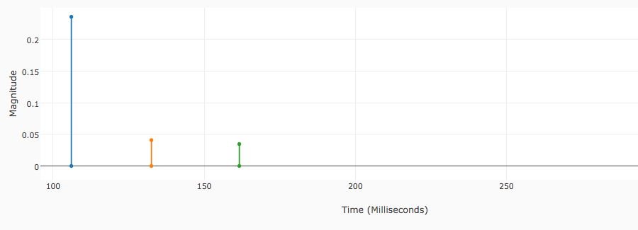
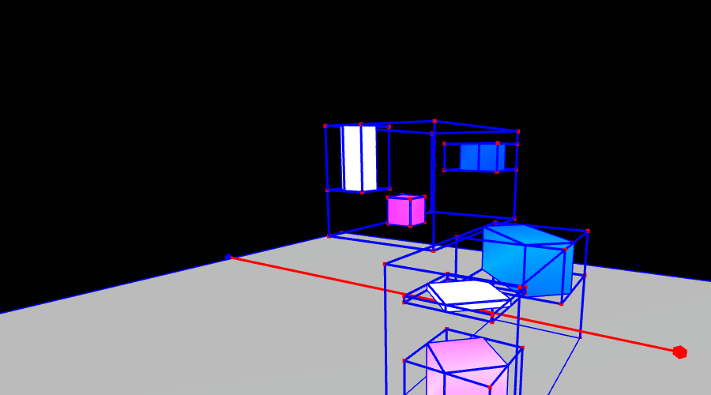

# Image Sources (Math 290)




This assignment was completed as part of 3D Digital Geometry (CS/Math 290) at Duke University during Spring 2016. The course was instructed by [Chris Tralie](http://www.ctralie.com/).

3D transformations are used to simulate "echos" resulting from specular reflections in simple scene graphs using webGL. The assignment builds on top of Tralie's mesh library that is currently under development. The API for that framework will be changed substantially in the near future. As such, this assignment makes use of an early protoype and plays fast and loose with the rendering business. If you go into the *libs* folder, things get *weird*.

The full assignment webpage can be found [here](http://www.ctralie.com/Teaching/COMPSCI290/Assignments/Group1_ImageSources/spec.html).

# Quickstart

View the full running demo [here](https://bmershon.github.io/image-sources).

The student's task is primarily concerned with adding functionality to the scenegraph, including the ability to:

- Generate image sources through reflections of a specified order (e.g. two bounces requires reflections of reflections)
- Generate paths from source to receiver
- Generate an impulse response based on the order-n reflection paths that have been generated
- Add functionality, such as implementing bounding boxes to speed up raytracing
- And much more!

For my own organization, I exposed the functionality that is expected to be added to the `scene` object as an extension that monkey patches these functions during runtime. The scene object holds all material objects in the scene, the cameras, the source, the receiver, and the reflected image sources and traced paths. It also has functions which mutate its state by computing new image sources, new paths, and new impulse response. Additionally, it has some features that allow the scene to accumulate transforms and compute bounding boxes (once and for all, since objects don't move in this simulation).

The files in the *src* folder are compiled (concatenated appropriately) to form a single global `image_sources` object with one method called `extend(scene)` that takes in the scene graph object and adds new methods to it. Given a scene, one adds the functionality by calling:

```js
image_sources.extend(scene);
```

To build *main/image_sources.js*, we follow the next few steps.

In the root directory, install all required dependencies as specified in *package.json* by running:

```bash
npm install
```

To build the *main/image_sources.js* file from source*:

```
npm run submit
```

This last command runs a script that looks at *index.js* and follows all the `import` and `export` statements found in the *src* directory to build a script with one exported global variable: `image_sources`. Checkout *package.json* to see the scripts that have been defined.

*Using [Rollup](https://github.com/rollup/rollup) to build the image-sources functionality into a single global variable is an attempt to make the student's work in this assignment modular. One significant advantage of doing so is that dependencies and coupling within the student's implementation are made more explicit and easier to follow.*

# Assignment Tasks

## Generating Image Sources

*A spherical mesh and first-order reflections from the source (off center, inside the sphere).*



## Path Extraction



## Impulse Response

Currently, impulses are placed in the nearest sampling bin without linear interpolation, Gaussian interpolation or any efforts to smooth the response.

*A campus quad scene with a small box to represent a human for scale (height 1.764 meters). Third order reflections are drawn for a scene with hierarchical rotations (all children rotated by 45 degrees under a "dummy node").*



*The .scn file*

```
{
  "name":"Campus Quad",
  "receiver":[0, 1.764, 0],
  "source":[-30, 1.764, 20],
  "p": 0.4,
  "children":[
    {
      "name": "campus",
      "transform":[0.70710678118, 0, 0.70710678118, 0,
                   0, 1, 0, 0,
                   -0.70710678118, 0, 0.70710678118, 0,
                   0, 0, 0, 1],
      "children": [
        {
          "mesh":"meshes/square.off",
          "color":[0.8, 0.8, 0.8],
          "rcoeff":0.5,
          "transform":[120, 0, 0, 0,
                       0, 75, 0, 0,
                       0, 0, 75, 0,
                       0, 0, 0, 1]     
        },

        .
        .
        .


        {
          "mesh":"meshes/box.off",
          "name": "human",
          "color":[0, 0.5, 0.5],
          "rcoeff":0.5,
          "transform":[0.5, 0, 0, 0,
                       0, 1.764, 0, 0.882,
                       0, 0, 0.2, -10,
                       0, 0, 0, 1]     
        }
      ]
    }
  ]
}
```

*A portion of the graph of the inpulse reponse. We note the direct line-of-sight reponse occurs around at 106 milliseconds and the next impulse occurs at around 132 milliseconds.*




## Bounding Boxes

We can speed up the path extraction algorithm by building **axis aligned bounding boxes (AABB)** around the meshes contained in a node.

*An example of bounding boxes drawn around two child nodes, each with scaled and rotated child meshes.*



The following process was used to build bounding boxes.

We can recursively build **extents** for each node, where an extent is an array of three tuples; each tuple is the min/max pair for the X, Y, and Z axis, in that order. An extent can be found for a node with a mesh and no children by iterating through its vertices and finding the corresponding min and max axis values.

The union of extents from a node's children along with that particular node's extent gives us an extent for any node in the tree.

*src/aabb/extent.js*
```js
// input vec3 objects
// returns array containing x, y, z bounds
export default function extent(vertices) {
  var n = vertices.length,
      b = [
            [Infinity, -Infinity],
            [Infinity, -Infinity],
            [Infinity, -Infinity]
      ];

  for (let i = 0; i < n; i++) {
    let v = vertices[i];
    for (let k = 0; k < 3; k++) {
      b[k][0] = (v[k] < b[k][0]) ? v[k] : b[k][0];
      b[k][1] = (v[k] > b[k][1]) ? v[k] : b[k][1];
    }
  }

  return b;
}
```
*src/aabb/union.js*

```js
// returns new extent that is the union of the provided extents
export default function union(extents) {
  var n = extents.length,
      u = [
            [Infinity, -Infinity],
            [Infinity, -Infinity],
            [Infinity, -Infinity]
      ];

  for (let i = 0; i < extents.length; i++) {
    let e = extents[i];
    for (let k = 0; k < 3; k++) {
      u[k][0] = (e[k][0] < u[k][0]) ? e[k][0] : u[k][0];
      u[k][1] = (e[k][1] > u[k][1]) ? e[k][1] : u[k][1];
    }
  }

  return u;
}
```

The above two functions are used in a recursive function to build up the extents and bounding boxes (actual PolyMesh object) in this beautiful function:

```js
import extent from "../aabb/extent";
import union from "../aabb/union";
import {default as makeNode} from "../aabb/makeNode";

// adding accumulated transforms to all children in scenograph

export default function computeBoundingBoxes() {
  var scene = this;
  if ('extent' in scene) return; // compute once
  bbox(scene);
}

function bbox(node) {
  let vertices,
      extents,
      totalExtent = [
            [Infinity, -Infinity],
            [Infinity, -Infinity],
            [Infinity, -Infinity]
      ];
  
  if ('mesh' in node) {
    vertices = node.mesh.vertices.map(function (d) {
      let transformed = vec3.create();
      vec3.transformMat4(transformed, d.pos, node.accumulated);
      return transformed;
    });
    totalExtent = extent(vertices);
  }

  if (node.children) {
    extents = node.children.map(function(d) { return bbox(d); });
    extents.push(totalExtent);
    totalExtent = union(extents);
  }

  node.extent = totalExtent; // array of extents
  node.aabb = makeNode(totalExtent); // (boudning box): node.mesh and node.accumulated
  return totalExtent;
}
```

In order to perform ray intersection tests on the bounding boxes, as well as render them using Tralie's existing mesh library, we can store an object on each node in the scene graph called `aabb`.

This `aabb` object has the following two properties:

- `aabb.mesh` is a unit cube that has been built using the provided *box.off* file (how cheeky!)
- 'aabb.accumulated` is the accumulated transform to place the unit cube in the correct world position

The rendering code was modified to allow for the bounding box to have only its vertices and edges rendered.

*N.B.* One issue to address is the situation in which the bounding box has **zero thickness** along any axis. Consider the *square.off* file that is rendered as four vertices making up once face. If you attempt to get the 6 *face normals* for this mesh by treating it as a cube, you will get a sequence of 4 vertices that have experienced scaling such that they coincide (e.g., v1 = v3, v2 = v4). This problem was addressed as follows:

```js
// return aabb mesh for this extent
export default function(extent) {
  var c, X, Y, Z,
      epsilon = 1e-6, // minimum scaling
      m = mat4.create(),
      lines =  ["COFF",
                "8 6 0",
                "-0.5 -0.5 0.5 0.5 0.5 0.5",
                "0.5 -0.5 0.5 0.5 0.5 0.5",
                "-0.5 0.5 0.5 0.5 0.5 0.5",
                "0.5 0.5 0.5 0.5 0.5 0.5",
                "-0.5 -0.5 -0.5 0.5 0.5 0.5",
                "0.5 -0.5 -0.5 0.5 0.5 0.5",
                "-0.5 0.5 -0.5 0.5 0.5 0.5",
                "0.5 0.5 -0.5 0.5 0.5 0.5",
                "4 0 1 3 2 ",
                "4 5 4 6 7 ",
                "4 4 0 2 6 ",
                "4 1 5 7 3 ",
                "4 2 3 7 6 ",
                "4 4 5 1 0 "],
      node = {};

  node.mesh = new PolyMesh();
  node.mesh.loadFileFromLines(lines);

  c =  [(extent[0][0] + extent[0][1])/2,
        (extent[1][0] + extent[1][1])/2,
        (extent[2][0] + extent[2][1])/2];

  X = Math.max(extent[0][1] - extent[0][0], epsilon);
  Y = Math.max(extent[1][1] - extent[1][0], epsilon);
  Z = Math.max(extent[2][1] - extent[2][0], epsilon);


  node.accumulated = [ X, 0, 0, c[0],
                       0, Y, 0, c[1],
                       0, 0, Z, c[2],
                       0, 0, 0, 1  ]; 

  for (var i = 0; i < 16; i++) {
    m[i] = node.accumulated[i];
  }
  mat4.transpose(m, m);
  node.accumulated = m;

  return node;
}
```

# Notes

Sometimes there are errors in calculating **normal faces**. I've tried to address this problem with some **numerical precision** "shims". Naturally, without having gone through rigorous unit-testing for this assignment, I'm sure there are lots of cases that break the code that I have not yet found.