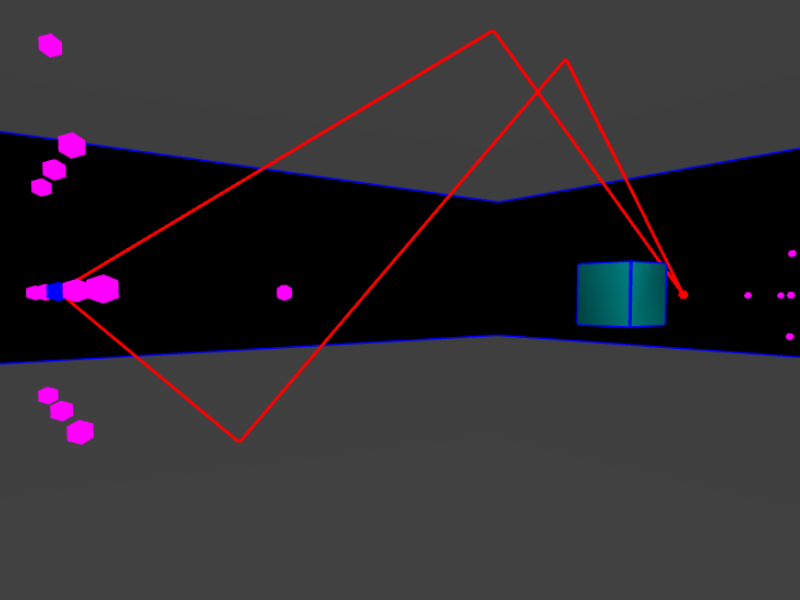
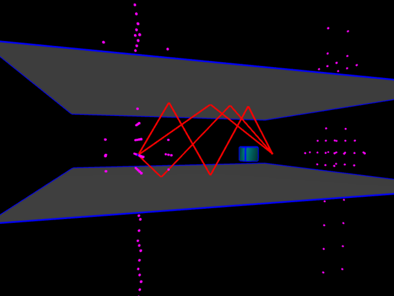
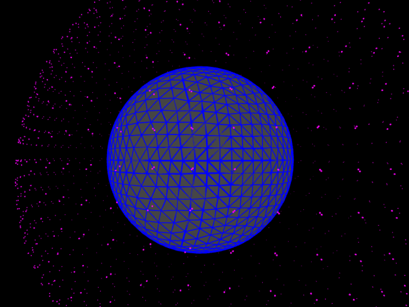
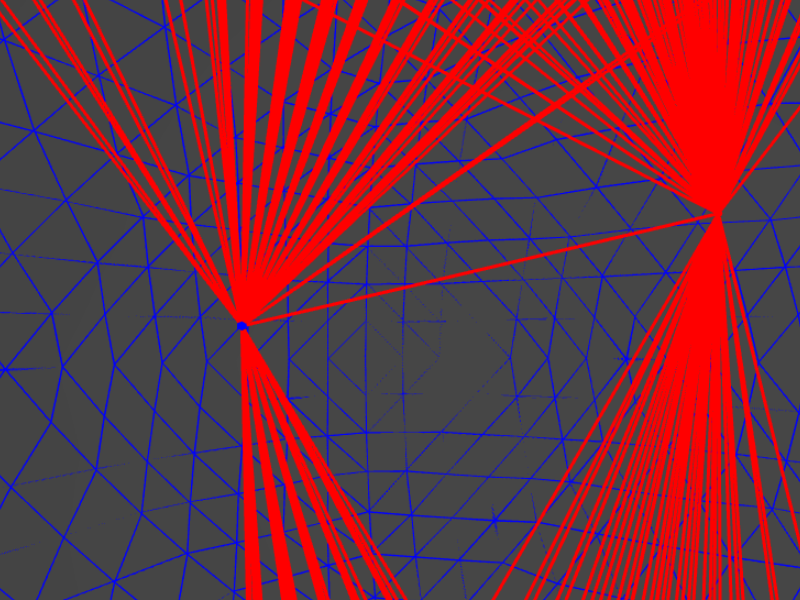

# Image Sources (Math 290)

This assignment was completed as part of Chris Tralie's *excellent* 3D geometry class (CS/Math 290) taught at Duke University during Spring 2016.

The assignment is concerned with introducing undergraduates to acoustic simulations. 3D transformations are used to simulate "echos" in simple scene graphs using webGL. The assignment builds on top of Tralie's *in progress* 3D geometry framework, which is primarily designed for teaching students about geometry operations on meshes. 

The full assignment webpage can be found [here](http://www.ctralie.com/Teaching/COMPSCI290/Assignments/Group1_ImageSources/spec.html).

*Second-order reflections in a simple scene graph*



*Third-order reflections in the same scene graph*



*First Order image sources generated from the sphere's mesh*




*First Order reflections with source and receiver inside a spherical mesh.*




# Quickstart

The student's task is primarily concerned with adding functionality to the scenegraph, including the ability to:

- Generage image sources through reflections of a specified order
- Gernate paths from source to receiver
- Generate an impulse response based on the order-n refleciton paths that have been generated
- Process a given audio file and perform convolution with the constructed impulse response

All this extra functionality is exposed as an extension that adds functions to `scene` object. The scene object holds all material objects in the scene, the cameras, the source, the receiver, and the reflected image sources and traced paths. The files in the *src* folder are compiled (concatenated appropriately) to form a single global `image_sources` object with one method called `extend(scene)` that takes in the sceneograph object and adds new methods to it. Given a scene, one adds the funtionality by calling:

```js
image_sources.extend(scene);
```

To build *main/image_sources.js* (the functionality this assignment tasks students with creating), we follow the next few steps.

In the root directory, install all required dependencies as specified in *package.json* by running:

```bash
npm install
```

To run all tests and build the *main/image_sources.js* file from source*:

```
npm run submit
```

This command runs a script that looks at *index.js* and follows all the `import` and `export` statements found in the *src* directory to build a script with one exported global variable: `image_sources`. Checkout *package.json* to see the scripts that have been defined.

*Using [Rollup](https://github.com/rollup/rollup) to build the image-sources functionality into a single global variable is an attempt to make the student's work in this assignment modular. One significant advantage of doing so is that dependencies and coupling within the student's implementation are made more explicit and easier to follow.*

# Assignment Tasks

The following tasks have been implemented in the *src* directory:

- [X] Generage image sources through reflections of a specified order
- [X] Implement rayIntersectPolygon and rayIntersect Faces using existing `visitChildren` method
- [X] Gernate paths from source to receiver for all order-n reflections
- [X] Generate an impulse response based on the order-n reflection paths that have been generated
- [ ] Generate cityscapes (automatically) to test large scale scenes (*Units are in meters*)
- [ ] Implement transmission through surfaces
- [ ] Support Binaural simulation
- [ ] Support bounding box tests to speed up culling of faces during ray tracing step
- [ ] Attempt to build a "whisper chamber"
- [ ] Test some dank tunes in a "club" and simulate transmission of lower frequencies to the "bathroom"

# Notes

- Added "p" field to *.scn* files; the value is used in simulating radial energy spreading. Lower values result in less attenuation.
- "Playing" the results in an error.