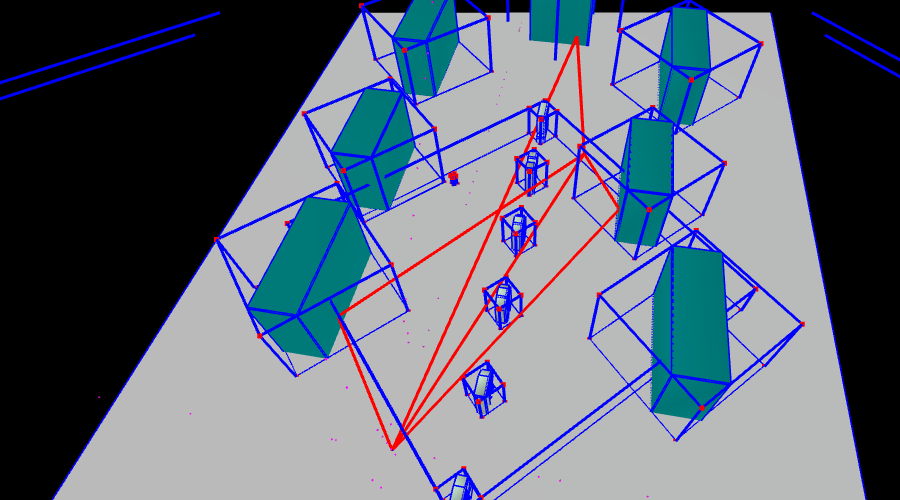
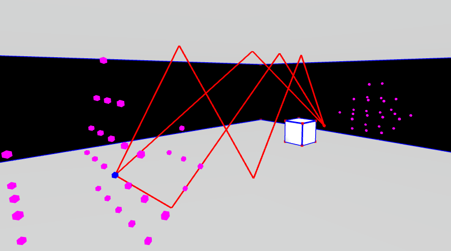
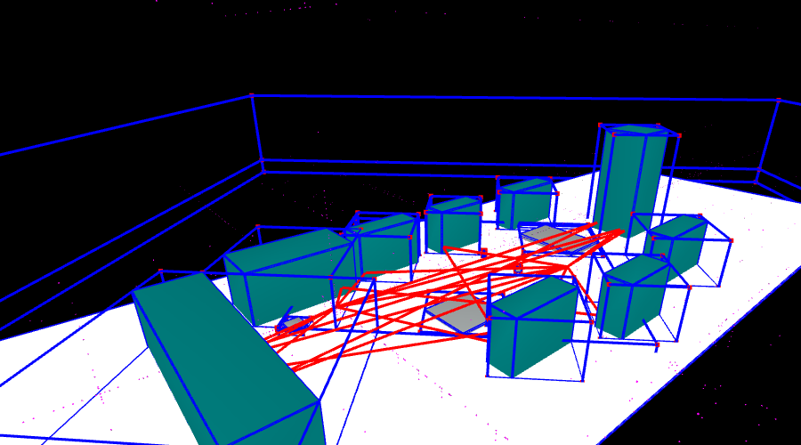
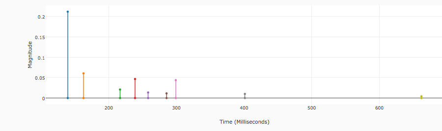

# Image Sources

*All images and code may be reproduced with the original author's name*.

If you are not reading this on GitHub, please view the project at:

https://github.com/bmershon/image-sources

To start playing, start a server in the root directory and view *index.html*:

```
python -m SimpleHTTPServer 8000
```

*Tested in Chrome Version 48.0.2564.116 (64-bit).* This code uses some ES2015 standards like the `let` statement.

===

This assignment was completed as part of 3D Digital Geometry (CS/Math 290), taken at Duke University during Spring 2016. The course was instructed by [Chris Tralie](http://www.ctralie.com/).

Specular reflections in simple scene graphs are used to simulate the impulse response for a source and receiver in a 3D environment. WebGL is used to visualize scene objects, reflections, bounding boxes, and so on. The assignment builds on top of Chris Tralie's mesh library that is currently under development. The API for that framework will be changed substantially in the near future. This assignment makes use of an early protoype and plays fast and loose with the rendering business. If you go into the *libs* folder, things get *weird*. 

This assignment is primarily concerned with the algorithms contained in the *src/* directory. This is the area of code written largely by the student, with small stubs provided by Chris Tralie as a skeleton for the main features to be implemented.

The full assignment webpage can be found [here](http://www.ctralie.com/Teaching/COMPSCI290/Assignments/Group1_ImageSources/spec.html).

*Aerial view of Blockington Campus. First-order reflections with bounding boxes shown.*



## Building from source

The student's task is primarily concerned with adding functionality to the **scene graph**, including the ability to:

- Generate image sources through reflections of a specified order (e.g. two bounces requires reflections of reflections)
- Generate paths from source to receiver
- Generate an **impulse response** based on the order-n reflection paths that have been generated
- Add bonus functionality, such as **implementing bounding boxes** to speed up raytracing, binaural responses, and much more!

For my own organization, I exposed the functionality that is expected to be added to the `scene` object as an extension that *[monkey patches](https://en.wikipedia.org/wiki/Monkey_patch)* these functions onto the `scene` object at runtime. The scene object holds all material objects in the scene, the cameras, the source, the receiver, and the reflected image sources and traced paths. It also has functions which mutate its state by computing new image sources, new paths, and a new impulse response. Additionally, it has some features that allow the scene to accumulate transforms and compute bounding boxes as a preprocessing step. For this assignment, the world's objects are assumed to be stationary, except for the source, receiver, and external camera.

The files in the *src* folder are compiled (concatenated) to form a single global `image_sources` object with one method called `extend(scene)` that takes in the scene graph object and adds new methods to it. Given a scene, one adds the functionality by calling:

```js
image_sources.extend(scene);
```

To build *main/image_sources.js*, we follow the next few steps.

In the root directory, install all required dependencies as specified in *package.json* by running:

```bash
npm install
```

To build the *main/image_sources.js* file from source*:

```
npm run submit
```

This last command runs a script that looks at *index.js* and follows all the `import` and `export` statements found in the *src* directory to build a script with one exported global variable: `image_sources`. Checkout *package.json* to see the scripts that have been defined.

*Using [Rollup](https://github.com/rollup/rollup) to build the image-sources functionality into a single global variable is an attempt to make the student's work in this assignment modular. One significant advantage of doing so is that dependencies and coupling within the student's implementation are made more explicit and easier to follow.*

## Assignment Tasks

### Generating Image Sources

*A spherical mesh and first-order reflections from the source (source outside sphere).*


*Third order reflections with floor, ceiling, and a box.*



###### Implementation

Image sources for **order-n reflections** are generated by recursively visiting each mesh in the scene and generating a reflection of a source of order (n-1) about the plane spanned by a face in a mesh. The recursive scene traversal is implemented as follows:

```js
export default function visitChildren(node, callback) {
  if (node === null || node === undefined || !node.children) return;

  for (let i = 0; i < node.children.length; i++) {
    let child = node.children[i];
    callback(node, child);
    visitChildren(child, callback);
  }
  
  return;
}
```

Low Polygon counts are used in the accoustic simulation because the number of image sources explodes as we increase the order of reflections. Higher polygon counts could be used for rendering if a lower resolution version of a mesh were provided for reflections and raytracing.

To reflect across a face, we

- Transform a face's normal into world coordinates using a normal matrix.
- Transform an arbitrary point on the face into world coordinates.
- Project a vector from an image source to the arbitrary point *onto* the transformed normal.
- Scale this projection by two and offset from the image source to get the reflection's position.

### Path Extraction

*Fourth-order reflections for the floor, ceiling, box scene.*


###### Implementation

Paths are built by tracing back from a receiver and noting intersections with appropriate faces along the way. The conditions to be checked in path construction can be read from the short `while` loop used to construct paths:

```js
    .
    .
    .

 while (target !== null) {
      vec3.sub(v, target.pos, p.pos); // aim at target
      soln = rayIntersectFaces(p.pos, v, scene, exclusion); // find intersection
      
      if (target.order == 0 && !scene.obscured(p.pos, target.pos, exclusion)) {
        path.push(scene.source);
        scene.paths.push(path); // complete path
      } else if (soln && soln.face == target.genFace) {
        p = {pos: soln.p, rcoeff: target.rcoeff}; // face intersection
        exclusion = target.genFace;
        path.push(p);
      } else {
        break; // abort path
      }
      target = target.parent; // image source that generated this target
  }
    
    .
    .
    .
    
```

### Impulse Response

*A campus quad scene with a small box to represent a human for scale (height 1.764 meters). Third order reflections are drawn for a scene with hierarchical rotations (the entire campus is rotated by 45 degrees). The bounding boxes around the three low level platforms allows many of the paths to avoid testing intersection with each of these objects: their bounding box lies below most of the paths.*



######Implementation

*The .scn file for this impulse response*

```
{
  "name":"Campus Quad",
  "receiver":[0, 1.764, 0],
  "source":[-30, 1.764, 20],
  "p": 0.4,
  "children":[
    {
      "name": "campus",
      "transform":[0.70710678118, 0, 0.70710678118, 0,
                   0, 1, 0, 0,
                   -0.70710678118, 0, 0.70710678118, 0,
                   0, 0, 0, 1],
      "children": [
        {
          "mesh":"meshes/square.off",
          "color":[0.8, 0.8, 0.8],
          "rcoeff":0.5,
          "transform":[120, 0, 0, 0,
                       0, 75, 0, 0,
                       0, 0, 75, 0,
                       0, 0, 0, 1]     
        },

        .
        .
        .


        {
          "mesh":"meshes/box.off",
          "name": "human",
          "color":[0, 0.5, 0.5],
          "rcoeff":0.5,
          "transform":[0.5, 0, 0, 0,
                       0, 1.764, 0, 0.882,
                       0, 0, 0.2, -10,
                       0, 0, 0, 1]     
        }
      ]
    }
  ]
}
```

The Impulse response is visualized as a lollipop graph, with time in milliseconds on the horizontal axis and the magnitude of the response on the vertical axis (0  to 1).

*The graph of the impulse reponse resulting from order-2 reflections, order-1 reflections, and line-of-site transmission.*



Listening to the *femalecountdown.ogg* file with high coefficients of reflection for the campus buildings certainly gives us a nice echo that can be easily discerned.

###### Nitty Gritty

Currently, impulses are placed in the nearest sampling bin without linear interpolation, Gaussian interpolation, or any other efforts to smooth the response.

### Bounding Boxes

We can speed up the path extraction algorithm by building **axis aligned bounding boxes (AABB)** around the meshes contained in a node. These bounding boxes may be tested for intersection to prevent unecessary attempts to intersect the faces of the nested objects for a given bounding box.

*An example of bounding boxes drawn around two child nodes, each with scaled and rotated child meshes.*


###### Implementation

We can recursively build **extents** for each node to represent the **union of bounding boxes** for that node and its children. An extent is an array of three tuples: each tuple is the [min, max] pair for the X, Y, and Z axis coordinates, in that order.

The union of extents from a node's children along with that particular node's extent gives us an extent for any node in the tree.

*src/aabb/extent.js*
```js
// input vec3 objects
// returns array containing x, y, z bounds
export default function extent(vertices) {
  var n = vertices.length,
      b = [
            [Infinity, -Infinity],
            [Infinity, -Infinity],
            [Infinity, -Infinity]
      ];

  for (let i = 0; i < n; i++) {
    let v = vertices[i];
    for (let k = 0; k < 3; k++) {
      b[k][0] = (v[k] < b[k][0]) ? v[k] : b[k][0];
      b[k][1] = (v[k] > b[k][1]) ? v[k] : b[k][1];
    }
  }

  return b;
}
```
*src/aabb/union.js*

```js
// returns new extent that is the union of the provided extents
export default function union(extents) {
  var n = extents.length,
      u = [
            [Infinity, -Infinity],
            [Infinity, -Infinity],
            [Infinity, -Infinity]
      ];

  for (let i = 0; i < extents.length; i++) {
    let e = extents[i];
    for (let k = 0; k < 3; k++) {
      u[k][0] = (e[k][0] < u[k][0]) ? e[k][0] : u[k][0];
      u[k][1] = (e[k][1] > u[k][1]) ? e[k][1] : u[k][1];
    }
  }

  return u;
}
```

The above two functions are used to build up the extents and bounding boxes (actual PolyMesh objects) in this beautiful function:

*src/aabb/makeNode.js*
```js
import extent from "../aabb/extent";
import union from "../aabb/union";
import {default as makeNode} from "../aabb/makeNode";

// adding accumulated transforms to all children in scenograph

export default function computeBoundingBoxes() {
  var scene = this;
  if ('extent' in scene) return; // compute once
  bbox(scene);
}

function bbox(node) {
  let vertices,
      extents,
      totalExtent = [
            [Infinity, -Infinity],
            [Infinity, -Infinity],
            [Infinity, -Infinity]
      ];
  
  if ('mesh' in node) {
    vertices = node.mesh.vertices.map(function (d) {
      let transformed = vec3.create();
      vec3.transformMat4(transformed, d.pos, node.accumulated);
      return transformed;
    });
    totalExtent = extent(vertices);
  }

  if (node.children) {
    extents = node.children.map(function(d) { return bbox(d); });
    extents.push(totalExtent);
    totalExtent = union(extents);
  }

  node.extent = totalExtent; // array of extents
  node.aabb = makeNode(totalExtent); // (boudning box): node.mesh and node.accumulated
  return totalExtent;
}
```

In order to perform ray intersection tests on the bounding boxes, as well as render them using Chris Tralie's existing mesh library, we can store an object on each node in the scene graph called `aabb`.

This `aabb` object has the following two properties:

- `aabb.mesh` is a unit cube that has been built using the provided *box.off* file (how cheeky!)
- `aabb.accumulated` is the accumulated transform that places the unit cube in the correct world position

*The rendering code was modified to allow for the bounding box to have only its vertices and edges rendered.*

###### Nitty Gritty

One issue to address is the situation in which the bounding box has **zero thickness** along any axis. Consider the *square.off* file that is rendered as four vertices making up once face. If you attempt to get the 6 *face normals* for this mesh by treating it as a cube, you will get a sequence of 4 vertices that have experienced scaling such that they coincide (e.g., v1 = v3, v2 = v4). This problem was addressed as follows:

```js
// return aabb mesh for this extent
export default function(extent) {
  var c, X, Y, Z,
      epsilon = 1e-6, // minimum scaling
      m = mat4.create(),
      lines =  ["COFF",
                "8 6 0",
                "-0.5 -0.5 0.5 0.5 0.5 0.5",
                "0.5 -0.5 0.5 0.5 0.5 0.5",
                "-0.5 0.5 0.5 0.5 0.5 0.5",
                "0.5 0.5 0.5 0.5 0.5 0.5",
                "-0.5 -0.5 -0.5 0.5 0.5 0.5",
                "0.5 -0.5 -0.5 0.5 0.5 0.5",
                "-0.5 0.5 -0.5 0.5 0.5 0.5",
                "0.5 0.5 -0.5 0.5 0.5 0.5",
                "4 0 1 3 2 ",
                "4 5 4 6 7 ",
                "4 4 0 2 6 ",
                "4 1 5 7 3 ",
                "4 2 3 7 6 ",
                "4 4 5 1 0 "],
      node = {};

  node.mesh = new PolyMesh();
  node.mesh.loadFileFromLines(lines);

  c =  [(extent[0][0] + extent[0][1])/2,
        (extent[1][0] + extent[1][1])/2,
        (extent[2][0] + extent[2][1])/2];

  X = Math.max(extent[0][1] - extent[0][0], epsilon);
  Y = Math.max(extent[1][1] - extent[1][0], epsilon);
  Z = Math.max(extent[2][1] - extent[2][0], epsilon);


  node.accumulated = [ X, 0, 0, c[0],
                       0, Y, 0, c[1],
                       0, 0, Z, c[2],
                       0, 0, 0, 1  ]; 

  for (var i = 0; i < 16; i++) {
    m[i] = node.accumulated[i];
  }
  mat4.transpose(m, m);
  node.accumulated = m;

  return node;
}
```

### Zoom to Extent

The GUI has a button "Zoom Extent" which places the camera at a corner of the bounding box (with a small offset to avoid seeing your own beacon). The camera then faces toward the center of the entire scene's bounding box. This is achived by adding a function `look(direction)` to the FPSCamera class:

*libs/GLEAT/Geometry/Camera3D.js*
```js
    this.look = function(direction) {
        var dir = vec3.clone(direction),
            right = vec3.create(),
            newUp = vec3.create();

        vec3.normalize(dir, dir);
        this.up = vec3.fromValues(0, 1, 0);
        vec3.cross(this.right, dir, this.up);
        vec3.cross(newUp, this.right, dir);
        this.up = newUp;
    }
```

The file *SceneFile.js* given to the student for this assignment was modified by adding the following function:

*main/SceneFile.js
```js
  // added feature
  glcanvas.zoomExtent = function() {
    var epsilon = 1,
        extent,
        c,
        corner,
        centroid,
        rotateRight,
        rotateDown,
        direction = vec3.create();
    // compute if not already computed
    scene.accumulateTransforms()
         .computeBoundingBoxes();
         
    // extent for the bbox computed for entire scene object
    extent = glcanvas.scene.extent;

    c = [(extent[0][0] + extent[0][1])/2,
         (extent[1][0] + extent[1][1])/2,
         (extent[2][0] + extent[2][1])/2];

    corner = vec3.fromValues(extent[0][0], extent[1][1], extent[2][1]);
    centroid = vec3.fromValues(c[0], c[1], c[2]);
    vec3.sub(direction, centroid, corner); // look at center of bbox

    vec3.add(corner, corner, vec3.fromValues(epsilon, epsilon, epsilon));
    this.camera.pos = corner; // corner of bbox
    this.camera.look(direction);
    requestAnimFrame(glcanvas.repaint);
  }
```

###### Nitty Gritty

Zoom-to-extent functionality can be improved by padding this bounding box positioning to avoid awkward positioning with respect to the given camera focal length and scene configuration.

### GUI Enchancement

A few hours were dedicated to making the GUI more better while adhering closely to the original functionality of the boilerplate assignment. The enhancements were made with pedagogy in mind: the interface is tailored to the student who implements the code, rather than a user who is only interested in running the simulation.
